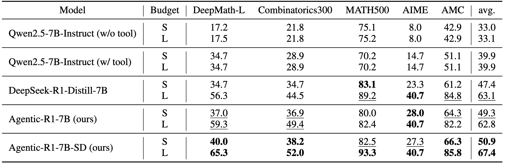

# DualDistill

[](LICENSE)
[](https://arxiv.org/abs/0000.00000)

Official implementation of **DualDistill**: A trajectory-composition distillation method for integrating tool use into long-chain-of-thought reasoning.

> **Weihua Du, Pranjal Aggarwal, Sean Welleck, & Yiming Yang**  
> ["Agentic-R1: Distilled Dual-Strategy Reasoning." (2025)](https://arxiv.org/abs/0000.00000) (coming soon)

## Key Features

- **Efficient Training**: Integrates tool use into long-chain-of-thought (CoT) reasoning using only 4 × A6000 GPUs
- **Unified Reasoning**: Fuses heterogeneous reasoning traces from multiple teacher models into a single student model

<div align="center">
  
  <p><em>Overview of DualDistill methodology</em></p>
</div>

## Datasets

| Dataset | Description | Link |
|---------|-------------|------|
| **Training Set** | Complete training dataset with teacher trajectories | [🤗 HuggingFace](https://huggingface.co/datasets/VanishD/DualDistill) |
| **Test Set** | Evaluation benchmarks | `dataset/test/` |

## Results

<div align="center">
  
  <p><b>Agentic-R1</b> demonstrates significant gains on DeepMath-L and Combinatorics300, where both complex reasoning and tool use are crucial. Furthermore, through self-distillation, <b>Agentic-R1-SD</b> can enhance performance and outperform baselines on nearly all tasks.</p>
</div>

## Quick Start

### Installation

1. **Clone the repository**:
   ```bash
   git clone https://github.com/StigLidu/DualDistill.git
   cd DualDistill
   ```

2. **Create environment** (optional but recommended):
   ```bash
   conda create -n dualdistill python=3.11
   conda activate dualdistill
   ```

3. **Install dependencies**:
   ```bash
   pip install -r requirements.txt
   pip install flash-attn --no-build-isolation
   ```

## Training Pipeline

### Step 1: Model & Data Preparation

**Download the base model**:
```bash
python script/data_script/model_download.py \
  --repo_id deepseek-ai/DeepSeek-R1-Distill-Qwen-7B \
  --local_dir models
```

**Prepare training data**:
```bash
python script/data_script/teacher_data_download.py
```

### Step 2: Teacher Distillation

Train the student model using teacher trajectories:
```bash
bash script/sft_script/SFT.sh
```

### Step 3: Self-Distillation

**Start inference server**:
```bash
bash script/eval_script/start_inference_server.sh [model_path] [display_name] [port]
```

**Sample self-distillation trajectories**:
```bash
python sft/self_distillation_sampler.py \
  --server_url http://localhost:$port/v1 \
  --model_name [display_name] \
  --model_path [model_path] \
  --save_path [path_to_save_trajectories]
```

**Prepare self-distillation data**:
```bash
# Extract teacher solutions
python script/data_script/extract_training_solution.py

# Construct training dataset
python script/data_script/processing_self_distillation_traj.py
```

**Fine-tune on self-distillation data**:
```bash
bash script/sft_script/expert_iteration.sh [model_path] [data_path] [save_path]
```

## Model Evaluation

### Start Inference Server
```bash
bash script/eval_script/start_inference_server.sh [model_path] [display_name] [port]
```

### Run Evaluation
```bash
bash script/eval_script/eval_remote_server.sh \
  [url] [display_name] [data_path] [code_mode] [max_token]
```

**Example**:
```bash
bash script/eval_script/eval_remote_server.sh \
  "http://localhost:8080/v1" "agentic-r1" "dataset/test/math.json" "true" "4096"
```

## Pre-trained Models

| Model | Description | HuggingFace Link |
|-------|-------------|------------------|
| **Agentic-R1-7B** | Base model with teacher distillation | [🤗 Download](https://huggingface.co/VanishD/Agentic-R1) |
| **Agentic-R1-7B-SD** | Enhanced model with self-distillation | [🤗 Download](https://huggingface.co/VanishD/Agentic-R1-SD) |

## ⚠️ Important Notes

- **Code Execution Safety**: The evaluation scripts execute model-generated code locally. Only use trusted models before execution.
- **Inference Config**: If you are using vLLM (a recent version) and encounter an error regarding the maximum context length. You may need to modify the `model_max_length` in `tokenizer_config.json`.
- **Self-Distillation Warning**: The self-distillation step requires sampling many trajectories and can be time-consuming.

## License

This project is licensed under the MIT License - see the [LICENSE](LICENSE) file for details.

## Acknowledgments

We thank the following open-source projects for their foundational contributions:

- [OpenHands](https://github.com/All-Hands-AI/OpenHands) - Agent framework
- [DeepMath-103K](https://huggingface.co/datasets/zwhe99/DeepMath-103K) - Mathematical reasoning dataset
- [vLLM](https://github.com/vllm-project/vllm) - High-performance inference engine

## Contact

For questions or support, please contact:

- **Weihua Du**: [weihuad@cs.cmu.edu](mailto:weihuad@cs.cmu.edu)

## Citation

If you find our work useful, please consider citing:

```bibtex
coming soon
```

---

<div align="center">
  <p>⭐ Star us on GitHub if this project helped you!</p>
</div>
